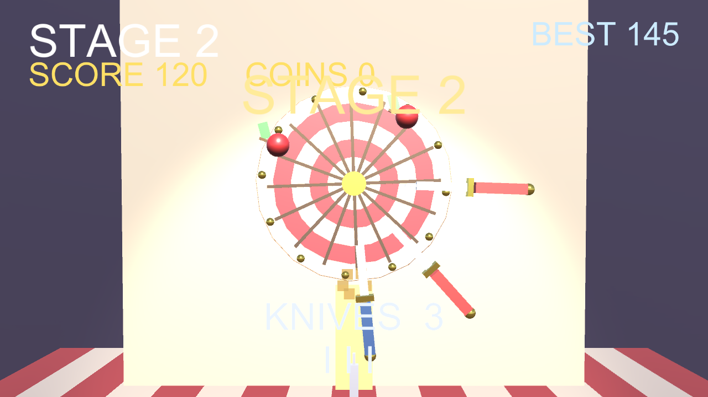

# BLADE CIRCUS

A one-tap 3D carnival knife-throwing game: stick blades into a spinning target wheel without hitting the ones already there, split apples for combos, and clear faster, trickier wheels — with steel boss wheels every 5 stages.

**▶ Play in browser:** https://masafykun.github.io/blade-circus/

## About
A small game built with Unity (6000.0.77f1). The C# source is under `src/`.
This repository also hosts a WebGL build, playable directly in the browser via GitHub Pages.
